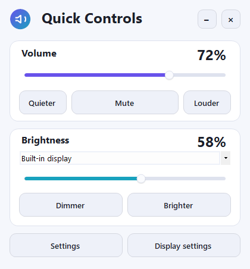
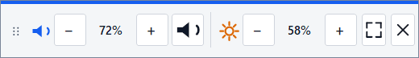
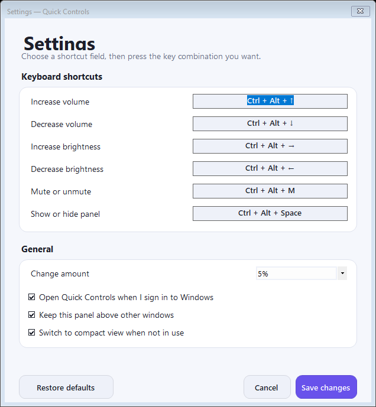

# Quick Controls for Windows — Volume & Brightness Hotkeys

[](https://github.com/tanngoc93/QuickControls/releases/latest)
[](https://github.com/tanngoc93/QuickControls/actions/workflows/build-and-release.yml)


**Quick Controls** is a lightweight Windows 10 and Windows 11 utility that adds customizable global keyboard shortcuts and a floating control panel for system volume, mute, laptop brightness, and compatible external monitor brightness. It is designed for keyboards without media keys and for anyone who wants faster controls without repeatedly opening Windows Settings.

<p align="center">
  
</p>

<p align="center">
  <a href="https://github.com/tanngoc93/QuickControls/releases/latest/download/QuickControls-Setup.exe"><strong>Download the Windows installer</strong></a>
  ·
  <a href="docs/USER-GUIDE.md">User guide</a>
  ·
  <a href="docs/TROUBLESHOOTING.md">Troubleshooting</a>
</p>

## The problem

Many compact, mechanical, and office keyboards do not have dedicated volume or brightness keys. Changing those settings interrupts your work, and external monitors often hide brightness behind physical buttons and nested menus.

## The solution

Quick Controls places six global hotkeys and a clean, movable panel within easy reach. It controls the default Windows audio output, built-in display brightness through Windows WMI, and compatible external monitor brightness through DDC/CI.

Install it once, then use your keyboard or the on-screen panel. There are no configuration files to edit and no commands for an end user to run.

## Features

- Create custom global volume and brightness keyboard shortcuts.
- Increase or decrease master volume and mute or unmute audio.
- Adjust laptop and all-in-one display brightness through Windows WMI.
- Adjust compatible external monitor brightness through DDC/CI.
- Choose between multiple detected brightness-capable displays.
- Use an expanded floating panel or a compact `336 x 64` control bar.
- Keep the panel above other windows or let it compact automatically.
- Choose a `2%`, `5%`, or `10%` adjustment step.
- See on-screen volume and brightness feedback after hotkey actions.
- Run quietly from the system tray and optionally start with Windows.
- Install per user without an administrator prompt.
- Keep preferences in a local settings file with no account or cloud service.

## Screenshots

| Compact volume and brightness panel | Keyboard shortcut settings |
| --- | --- |
|  |  |

## Install Quick Controls

1. [Download `QuickControls-Setup.exe`](https://github.com/tanngoc93/QuickControls/releases/latest/download/QuickControls-Setup.exe).
2. Open the downloaded file.
3. Select **Install now**.
4. Use the panel or the default shortcuts immediately.

The installer creates Desktop and Start menu shortcuts, registers Quick Controls in Windows Installed Apps, and starts the app in the system tray. No folder selection or technical setup is required.

> **Windows security notice:** the current release is not signed with a commercial code-signing certificate. Windows SmartScreen may display a publisher warning. Only continue when the file came from this repository's official Releases page. Managed computers may block unsigned apps completely; see [Troubleshooting](docs/TROUBLESHOOTING.md#windows-smartscreen-warns-about-the-installer).

### System requirements

- Windows 10 or Windows 11.
- .NET Framework 4, included with supported Windows installations.
- A Windows audio output device for volume controls.
- A WMI-compatible built-in display or DDC/CI-compatible external monitor for brightness controls.

Volume features still work when monitor brightness control is unavailable.

## Default shortcuts

| Shortcut | Action |
| --- | --- |
| `Ctrl + Alt + Up` | Increase volume |
| `Ctrl + Alt + Down` | Decrease volume |
| `Ctrl + Alt + Right` | Increase brightness |
| `Ctrl + Alt + Left` | Decrease brightness |
| `Ctrl + Alt + M` | Mute or unmute |
| `Ctrl + Alt + Space` | Show or hide the control panel |

The shortcuts work while another normal desktop app is focused. If a combination is already used, open **Settings**, select its shortcut field, press a new combination, and select **Save changes**.

## External monitor brightness control

Quick Controls uses DDC/CI for compatible external monitors. If external monitor brightness is unavailable:

1. Open the monitor's built-in menu with its physical controls.
2. Find and enable **DDC/CI**.
3. Try a direct HDMI or DisplayPort connection.
4. Avoid a dock, hub, KVM switch, or adapter that does not forward DDC/CI commands.

Not every monitor, TV, dock, or cable path exposes software brightness controls. Read the complete [display compatibility guide](docs/DISPLAY-COMPATIBILITY.md).

## Privacy and permissions

Quick Controls handles settings and device commands locally. The application has no server component, user account, analytics SDK, or automatic update service.

- App files: `%LOCALAPPDATA%\Programs\QuickControls`
- Saved settings: `%LOCALAPPDATA%\QuickControls\settings.xml`
- Startup entry: current-user Windows `Run` registry key, when enabled
- Administrator elevation: not requested

## Build from source

The project uses C# Windows Forms on .NET Framework 4.0. The build script calls the C# compiler included with Windows and uses the project's own installer packager, so Visual Studio, the modern .NET SDK, and Inno Setup are not required.

```powershell
git clone https://github.com/tanngoc93/QuickControls.git
Set-Location QuickControls
powershell -ExecutionPolicy Bypass -File .\scripts\build.ps1
```

Generated binaries, the installer, portable ZIP, icon, and UI previews are written to `artifacts`.

Run the automated checks:

```powershell
powershell -ExecutionPolicy Bypass -File .\scripts\test.ps1
```

Inspect audio, brightness, and shortcut support on the current computer without changing active levels:

```powershell
powershell -ExecutionPolicy Bypass -File .\scripts\hardware-check.ps1
```

See [Building from source](docs/BUILDING.md) for signing, hardware-write verification, and all generated outputs.

## Documentation

- [User guide](docs/USER-GUIDE.md) — installation, panel, shortcuts, settings, system tray, updates, and uninstall.
- [Display compatibility](docs/DISPLAY-COMPATIBILITY.md) — laptop WMI brightness and external monitor DDC/CI support.
- [Troubleshooting](docs/TROUBLESHOOTING.md) — shortcut conflicts, unavailable devices, SmartScreen, and installer errors.
- [Building from source](docs/BUILDING.md) — build, test, hardware verification, and code signing.
- [Architecture](docs/ARCHITECTURE.md) — Windows APIs, runtime components, local settings, and installer design.
- [Changelog](CHANGELOG.md) — user-facing changes by release.
- [Quick Controls 1.0.0 release notes](docs/releases/v1.0.0.md) — downloads, features, checksums, and the signing notice.
- [Contributing](CONTRIBUTING.md) — project conventions, verification, and bug-report details.

## Frequently asked questions

### How can I control Windows volume without media keys?

Install Quick Controls and use `Ctrl + Alt + Up` or `Ctrl + Alt + Down`. You can replace both combinations with shortcuts that fit your keyboard.

### Can I create custom volume and brightness keyboard shortcuts?

Yes. Open **Settings**, select any shortcut field, and press the key combination you want. Each shortcut must include `Ctrl`, `Alt`, `Shift`, or the Windows key.

### Do the shortcuts work while another app is open?

Yes, Quick Controls registers global Windows shortcuts. A shortcut can still be unavailable if another application already registered it, and some elevated or exclusive full-screen applications can intercept keyboard input.

### Can Quick Controls adjust an external monitor?

Yes, when the monitor and connection expose DDC/CI brightness control. Enable DDC/CI in the monitor menu and prefer a direct HDMI or DisplayPort connection.

### Can I choose which monitor to control?

Yes. When multiple compatible displays are detected, choose one from the Brightness card. Quick Controls remembers the selected display.

### Does Quick Controls start with Windows?

It can. **Open Quick Controls when I sign in to Windows** is enabled by default and can be changed in Settings or from the system tray menu.

### Does installation require administrator access?

No. Quick Controls installs for the current Windows user and its manifest does not request elevation.

### Why does Windows SmartScreen warn about the installer?

The current installer is unsigned, so Windows cannot verify a publisher. Download only from this repository's Releases page and read the [security warning guidance](docs/TROUBLESHOOTING.md#windows-smartscreen-warns-about-the-installer).

### How do I remove Quick Controls and its settings?

Uninstall it from **Windows Settings > Apps > Installed apps**. Select **Also delete saved shortcuts and settings** in the uninstaller to remove the local preferences too.

## Project structure

```text
QuickControls/
|-- src/QuickControls/          C# WinForms application source
|-- installer/                  One-click per-user installer source
|-- scripts/build.ps1           Build, package, sign, and render previews
|-- scripts/test.ps1            Automated artifact and UI checks
|-- scripts/hardware-check.ps1  Optional hardware integration check
|-- docs/                        User and developer documentation
|-- .github/workflows/           Windows build and release automation
|-- QuickControls.sln
|-- CHANGELOG.md
|-- CONTRIBUTING.md
`-- README.md
```

Generated `artifacts`, `bin`, and `obj` directories are intentionally excluded from Git. Release binaries belong on the [GitHub Releases page](https://github.com/tanngoc93/QuickControls/releases).
